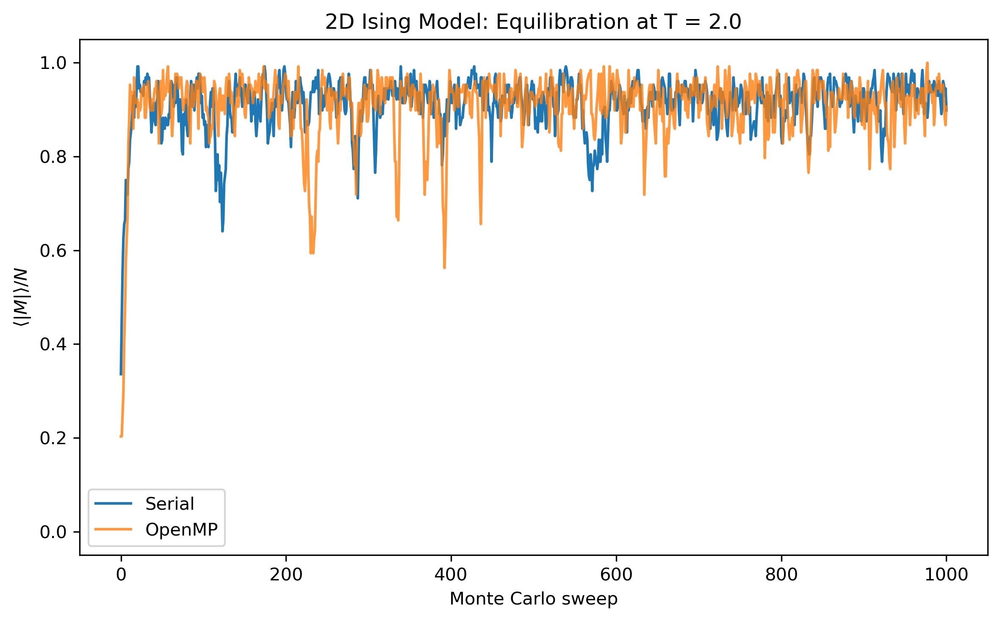
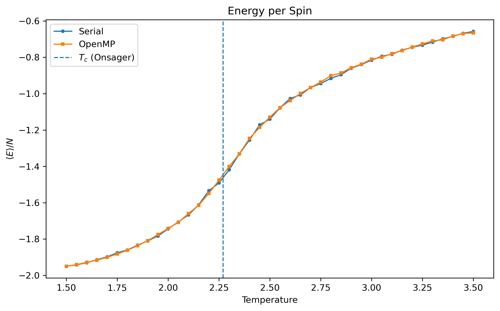
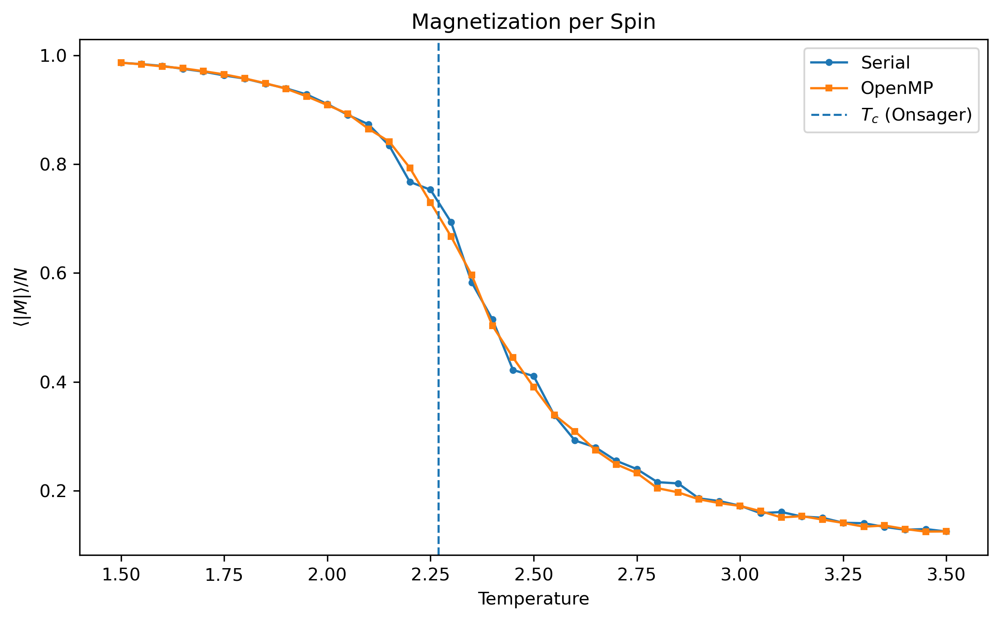
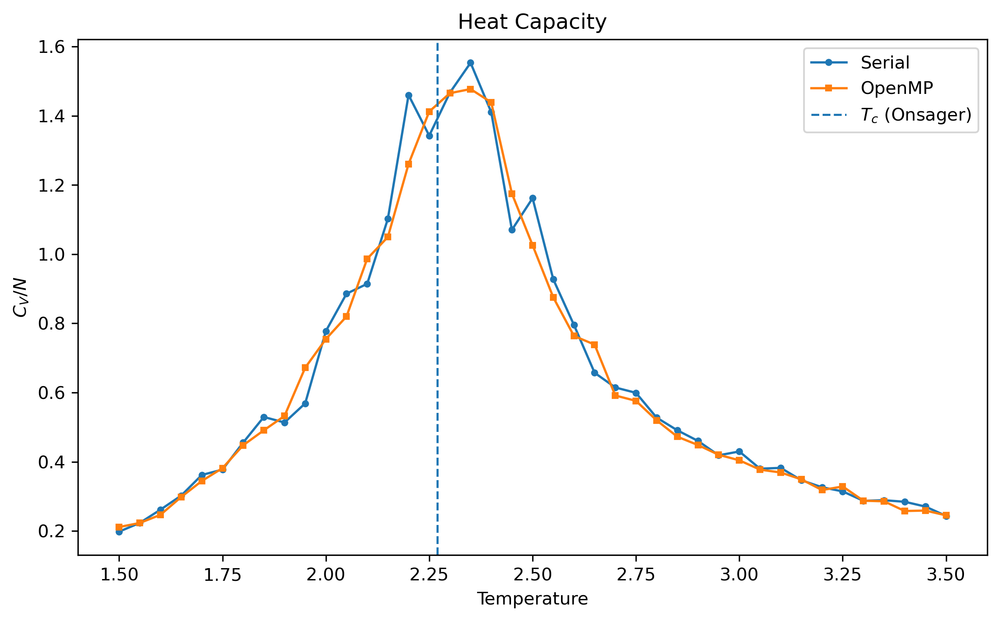
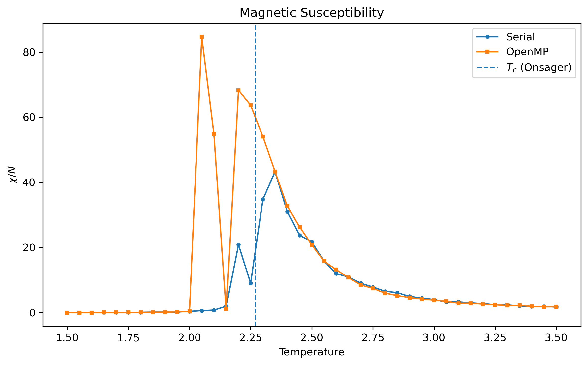
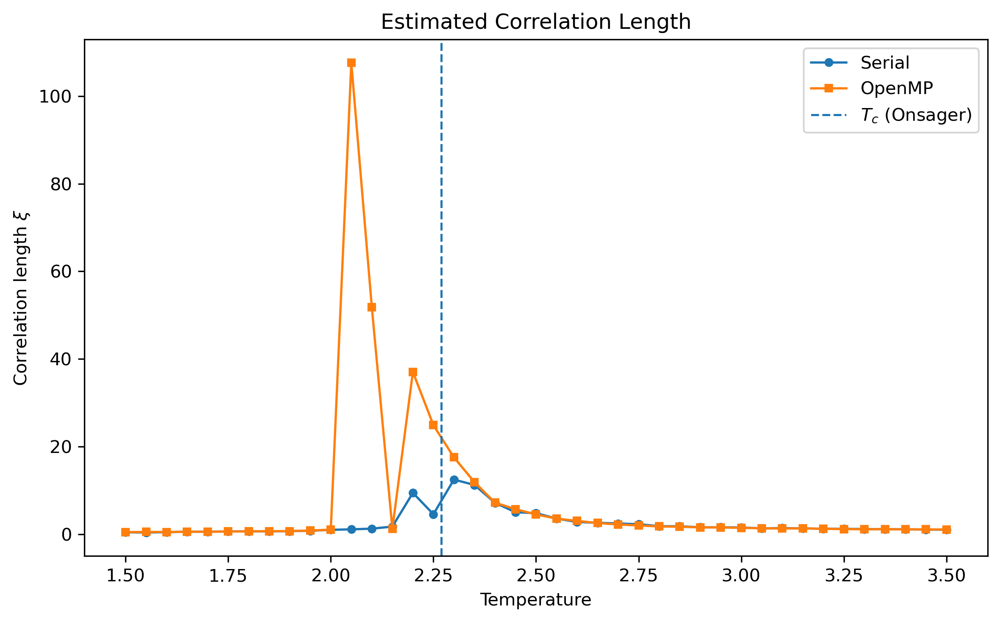

# Parallel 2D Ising Model with OpenMP

Numerical simulation of the two-dimensional Ising model using Monte Carlo methods, with serial and OpenMP implementations in C.

The project studies the thermodynamic behavior of a square-lattice Ising system across its phase transition and explores the parallelization of the Metropolis algorithm using a red-black checkerboard decomposition.

Originally developed as part of a Parallel Programming course at Universidad de Valparaíso and subsequently reorganized as a reproducible scientific-computing project.

---

## Overview

The two-dimensional Ising model is one of the fundamental models of statistical mechanics. It consists of a square lattice of spins

$$
s_i = \pm 1,
$$

interacting with their nearest neighbors.

The Hamiltonian is

$$
H =
-J\sum_{\langle i,j\rangle}s_i s_j
-B\sum_i s_i,
$$

where \(J\) is the nearest-neighbor interaction strength and \(B\) is the external magnetic field.

In this implementation,

$$
J = 1,
\qquad
B = 0,
\qquad
k_B = 1.
$$

The lattice uses periodic boundary conditions.

---

## Monte Carlo Method

Configurations are evolved using the Metropolis algorithm.

For a proposed spin flip, the energy variation is

$$
\Delta E =
2J s_i
\sum_{j\in\mathrm{nn}(i)}s_j
+
2B s_i.
$$

The spin is flipped whenever

$$
\Delta E \leq 0,
$$

or, when \(\Delta E > 0\), with probability

$$
P =
\exp\left(-\frac{\Delta E}{T}\right).
$$

One Monte Carlo sweep corresponds to one attempted update per lattice spin on average.

---

## Parallelization Strategy

The OpenMP implementation uses a red-black checkerboard decomposition:

```text
A B A B ...
B A B A ...
A B A B ...
B A B A ...
```

This divides the square lattice into two sublattices.

Nearest-neighbor spins always belong to opposite colors. Therefore, all spins belonging to one color can be updated concurrently before switching to the second color.

This avoids simultaneous updates of nearest-neighbor spins and allows the Metropolis evolution to be parallelized using shared-memory OpenMP.

Independent pseudo-random-number-generator states are maintained for each OpenMP thread.

> The checkerboard implementation assumes an even lattice size when periodic boundary conditions are used.

---

## Observables

The simulation evaluates several thermodynamic quantities.

### Energy

$$
\frac{\langle E\rangle}{N}.
$$

### Magnetization

For the finite lattice, the absolute magnetization is used as an order parameter:

$$
\frac{\langle |M|\rangle}{N}.
$$

### Heat Capacity

$$
\frac{C_V}{N}
=
\frac{
\langle E^2\rangle-\langle E\rangle^2
}{
NT^2
}.
$$

### Magnetic Susceptibility

$$
\frac{\chi}{N}
=
\frac{
\langle M^2\rangle-\langle M\rangle^2
}{
NT
}.
$$

### Connected Correlation Function

$$
C(r)
=
\langle s_i s_{i+r}\rangle
-
\langle s\rangle^2.
$$

An exponential model,

$$
C(r)
=
A e^{-r/\xi},
$$

is used to estimate the correlation length \(\xi\).

---

## Critical Temperature

For the infinite two-dimensional square-lattice Ising model at zero external field, the exact critical temperature is

$$
T_c
=
\frac{2J}{
\ln(1+\sqrt{2})
}.
$$

For \(J=k_B=1\),

$$
T_c \approx 2.269.
$$

This exact value is included in the numerical plots as a reference.

---

## Repository Structure

```text
ising-model-openmp/
│
├── README.md
├── LICENSE
├── Makefile
├── requirements.txt
├── .gitignore
│
├── src/
│   ├── ising_serial.c
│   └── ising_openmp.c
│
├── scripts/
│   └── plot_results.py
│
└── results/
    ├── data/
    │   ├── serial/
    │   │   ├── equilibration.csv
    │   │   ├── thermodynamics.csv
    │   │   └── correlation.csv
    │   │
    │   └── openmp/
    │       ├── equilibration.csv
    │       ├── thermodynamics.csv
    │       └── correlation.csv
    │
    └── figures/
        ├── equilibration_magnetization.png
        ├── energy_vs_temperature.png
        ├── magnetization_vs_temperature.png
        ├── heat_capacity.png
        ├── susceptibility.png
        └── correlation_length.png
```

---

## Compilation

A C compiler with OpenMP support is required.

Compile both implementations with

```bash
make
```

This generates

```text
bin/ising_serial
bin/ising_openmp
```

The generated binaries are excluded from version control.

---

## Running the Simulations

### Serial implementation

```bash
./bin/ising_serial
```

or

```bash
make run-serial
```

### OpenMP implementation

The number of OpenMP threads can be specified with `OMP_NUM_THREADS`.

For example,

```bash
export OMP_NUM_THREADS=4
./bin/ising_openmp
```

or

```bash
OMP_NUM_THREADS=4 make run-openmp
```

A fixed random seed is used by default to improve reproducibility.

An alternative seed can be supplied through the command line:

```bash
./bin/ising_serial 42
```

or

```bash
OMP_NUM_THREADS=4 ./bin/ising_openmp 42
```

---

## Quick Test

A reduced simulation is available to verify compilation and the numerical pipeline without running the complete calculation.

Compile it with

```bash
make quick
```

and execute

```bash
make run-quick
```

Quick-test outputs are stored separately in

```text
results/data/test/
```

and are excluded from version control.

---

## Python Analysis

Install the required Python packages with

```bash
python3 -m pip install -r requirements.txt
```

After running both simulations, generate the figures with

```bash
make plots
```

or

```bash
python3 scripts/plot_results.py
```

---

## Numerical Results

### Equilibration



At \(T=2.0<T_c\), the system evolves toward a strongly magnetized state, consistent with the ordered phase.

### Energy



The mean energy per spin increases as the system evolves from the ordered low-temperature phase toward the disordered high-temperature regime.

### Magnetization



The magnetization decreases rapidly in the vicinity of the phase-transition region.

### Heat Capacity



The heat capacity exhibits enhanced fluctuations around the critical region.

### Magnetic Susceptibility



Magnetic fluctuations increase strongly near the phase transition.

### Correlation Length



The connected correlation function is fitted with an exponential model in order to estimate the characteristic correlation length.

---

## Serial and OpenMP Implementations

The repository contains both serial and shared-memory parallel implementations.

The two approaches reproduce the same qualitative thermodynamic behavior but use different spin-update strategies:

* the serial implementation performs random single-spin Metropolis updates;
* the OpenMP implementation uses checkerboard updates to allow concurrent spin evolution.

For this reason, raw execution times should not yet be interpreted as a strict one-to-one parallel speedup measurement.

A dedicated benchmarking implementation using equivalent update schemes would be required for rigorous strong-scaling analysis.

---

## Reproducibility

The simulation uses a fixed default random seed.

This makes numerical experiments reproducible while still allowing alternative seeds to be specified from the command line.

Simulation outputs are stored as CSV files and the plotting pipeline can regenerate all figures directly from those results.

---

## Technologies

* C
* OpenMP
* Python
* NumPy
* pandas
* SciPy
* Matplotlib
* GNU Make
* Linux

---

## Author

**Pía Barría Herrera**
Physics undergraduate
Universidad de Valparaíso, Chile

[ORCID](https://orcid.org/0009-0009-2585-3441)

---

## License

This project is distributed under the MIT License.
